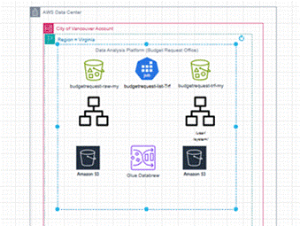

# Descriptive Analysis
## Project Title: Descriptive Analysis of 2024 Multi-Year Capital Project Budget requests and Capital Expenditure Budget at City of Vancouver 
## Project Description
This project involves performing descriptive analysis on a municipal capital budget request dataset to uncover trends, service category distributions, and funding patterns using AWS Glue DataBrew.
---

### **Objective**  
To design and implement a robust Data Analytics Platform (DAP) using AWS that transforms raw multi-year captial project budget data into structured, high-quality datasets for analysis, forecasting, and visualization. The goal is to uncover trends in funding allocations, evaluate financial priorities across service categories, and support informed decision-making by transforming raw budget data into structured insights that highlight long-term capital planning and financial sustainability.

---

## Major Dataset Columns and Definitions

- **ProjectId** – Unique code assigned to each capital project.  
- **ProjectProgramName** – Name or title of the project being proposed.  
- **ServiceCategory1** – The primary category of public service related to the project (e.g., Parks, Housing).  
- **TotalOpenProjectBudgetIn2024** – Budget allocated for the project for the year 2024.  
- **MultiYearCapitalProjectBudgetsPreviouslyApproved** – Previously approved budget for multi-year projects.  
- **DeliveryDepartment** – Department responsible for executing the project.  
- **CommunityPriority** – Indicator showing whether the project aligns with community-identified priorities.

---

## Design


---


## Methodology

1. **Data Collection**  
   - Load dataset from AWS S3 into AWS Glue DataBrew.

2. **Descriptive Statistics**  
   - Analyze key metrics:  
     - Total number of projects  
     - Distribution across service categories  
     - Budget totals and correlations  
     - Frequency of community-priority projects
       
       
      

3. **Data Visualization**  
   - Create visual aids:  
     - Bar charts for project distribution  
     - Pie charts for category-wise proportions  
     - Heatmaps to show budget correlations
       

4. **Insights and Findings**  
   - Parks & Public Spaces had the highest requests (113).  
   - High data validity with <1% missing values.  
   - Strong correlation (0.99) between multi-year and 2024 budgets.

5. **Recommendations**  
   - Prioritize funding for high-demand categories.  
   - Use budget correlations to enhance financial planning.  
   - Align future proposals with community priorities.

---

## Tools and Technologies

- **AWS Glue DataBrew** – Used for dataset profiling and statistics  
- **AWS S3** – Used for storing raw and transformed datasets  
- **Draw.io** – Used to visualize project workflow and architecture  
- **CSV Format** – File type used for input data

---

## Deliverables

- AWS Glue DataBrew data profile report  
- Visual charts (bar, pie, heatmap)  
- Workflow diagram  
- Summary of insights and actionable recommendations
```

