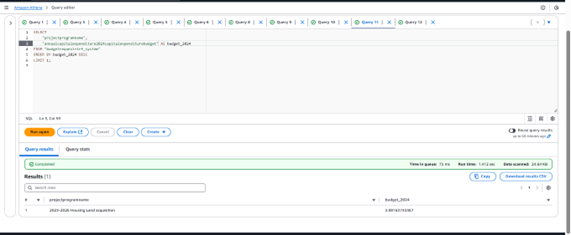
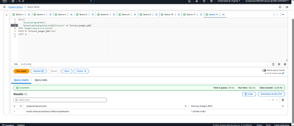
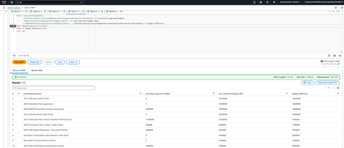
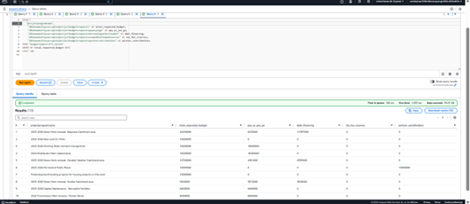
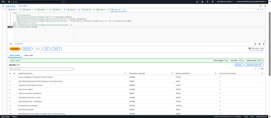
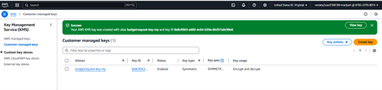
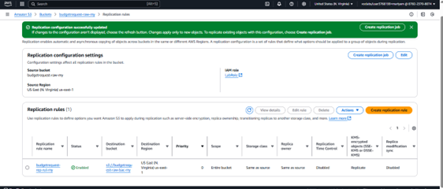
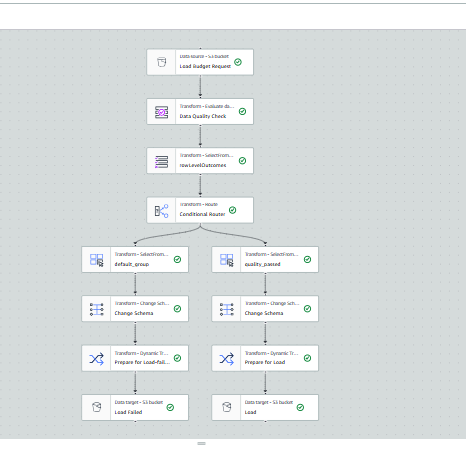
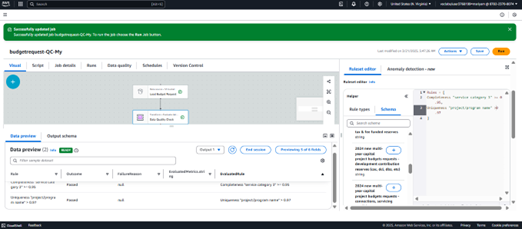
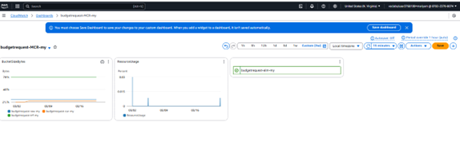

criptive analysis, data# Phase 2 – Data Analytics Platform (DAP) for City of Vancouver Budget Dataset

---

### **Project Title**  
**Phase 2: Data Analytics Platform (DAP) Enhancement for 2024 Multi-Year Capital Project Budget requests and Capital Expenditure Budget at City of Vancouver**

---

### **Project Description**  
This phase continues the implementation of the AWS-based Data Analytics Platform (DAP) using the City of Vancouver’s 2024 Multi-Year Capital Project Budget requests and Capital Expenditure Budget dataset. Following the initial ingestion, descriptive analysis, data wrangling and cataloging of data. 

---

### **Objective**  
To enhance the City of Vancouver’s AWS Data Lake platform with powerful diagnostics, governance policies, and real-time monitoring while ensuring secure and cost-effective handling of financial and planning data.

---

### **Dataset**  
- **Title**: 2024 Multi-Year Capital Project Budget Requests and Capital Expenditure Budget  
- **Source**: City of Vancouver Open Data Portal  
- **Scope**: Project-level data with budget requests, forecasts (2024–2026), funding types, and approvals
- **Key Fields**:  
  - **ProjectId** – Unique code assigned to each capital project.  
  - **ProjectProgramName** – Name or title of the project being proposed.  
  - **ServiceCategory1** – The primary category of public service related to the project (e.g., Parks, Housing).  
  - **TotalOpenProjectBudgetIn2024** – Budget allocated for the project for the year 2024.  
  - **MultiYearCapitalProjectBudgetsPreviouslyApproved** – Previously approved budget for multi-year projects.  
  - **DeliveryDepartment** – Department responsible for executing the project.  
  - **CommunityPriority** – Indicator showing whether the project aligns with community-identified priorities.

---

### **Methodology**

The implementation methodology for Phase 2 of the DAP project involved building on the foundation established in Phase 1 and enhancing the system with robust analytical, governance, and optimization capabilities. Below are the detailed steps executed across five key areas:

#### **1. Data Analysis using Amazon Athena**
- The `budgetrequest-trf_system` and `budgetrequest-metrics` tables created via AWS Glue Crawlers were used to perform SQL-based analysis in Athena.
- **Query Editor Configuration:**
  - Data Source: `AwsDataCatalog`
  - Database: `budgetrequest-catalog-my`
  - Query Output: `s3://budgetrequest-cur-my`
- **Analysis Executed:**
  - Identified most expensive projects by filtering and sorting budget columns for 2024 and 2025.
    
   
    
  - Analyzed forecasted budgets for 2024–2026 to identify long-term high-impact projects.

    
    
  - Compared 2024 requested budgets to prior approvals to identify major changes in financial planning.
 
    
    
  - Broke down funding across sources: pay-as-you-go, debt, reserves, and partner contributions.

    

  - Highlighted projects with >10% partner contribution to explore public-private collaborations.

    
      

#### **2. Data Security using AWS KMS and S3 Encryption**
- Created a **symmetric key** using **AWS Key Management Service (KMS)**.
- Assigned administrative and usage permissions to IAM role `LabRole`.
- Updated encryption settings for all S3 zones:
  - Raw: `budgetrequest-raw-my`   
  - Transformed: `budgetrequest-trf-my`
  - Curated: `budgetrequest-cur-my`

     

    
- Ensured data is encrypted at rest using the custom key during upload and decrypted during access.
- Enabled **S3 versioning** for data protection against accidental deletions or overwrites.
- Configured **replication rules** to backup data to cross-region buckets while preserving encryption and versioning.

 

#### **3. Data Governance with AWS Glue Studio (ETL & Quality Checks)**
- Created a visual ETL job `budgetrequest-QC-My` to implement data quality validation on the raw dataset.

- Applied built-in transformations for:
  - **Completeness**: Required ≥95% non-null values in `Service Category 3`
  - **Uniqueness**: Ensured ≥99% uniqueness in `Project/Program Name`

   

  
- Used **Conditional Router** to split rows based on quality checks:
  - Passed rows: saved to `s3://budgetrequest-trf-my/Quality_Check/Passed/`

   
  
  - Failed rows: saved to `s3://budgetrequest-trf-my/Quality_Check/Failed/`

  
  
- Cleaned out helper columns and optimized output files using **Autobalance Processing**.

#### **4. Monitoring and Controlling with CloudWatch and CloudTrail**
- **CloudWatch Dashboards** created for:
  - S3 metrics: `BucketSizeBytes`, `NumberOfObjects`
  - AWS Glue JobRun metrics: execution time, success/failure count
  - Billing thresholds with custom alerts and notification subscriptions

  

  
- Set alarm thresholds (e.g., 400K bucket size) and configured alert delivery to `notification_for_team` email list.
- **CloudTrail** configured to track API and user actions, storing logs securely in:
  - `s3://aws-cloudtrail-logs-878223708074-b9bac22d/...`

### **Tools and Technologies**
- **AWS Glue**, **Glue Studio**, **Athena**, **S3**, **KMS**, **CloudWatch**, **CloudTrail**, **IAM**
- **SQL**, **ETL Pipelines**, **Versioning**, **Lifecycle Policies**, **Monitoring Dashboards**

---

### **Deliverables**
- SQL queries and Athena analysis results
- Configured encryption, versioning, and replication policies
- ETL visual pipeline with row-level quality tracking
- CloudWatch dashboards and billing alerts
- Secure and governed S3 data lake structure (raw, curated, transformed)

---

