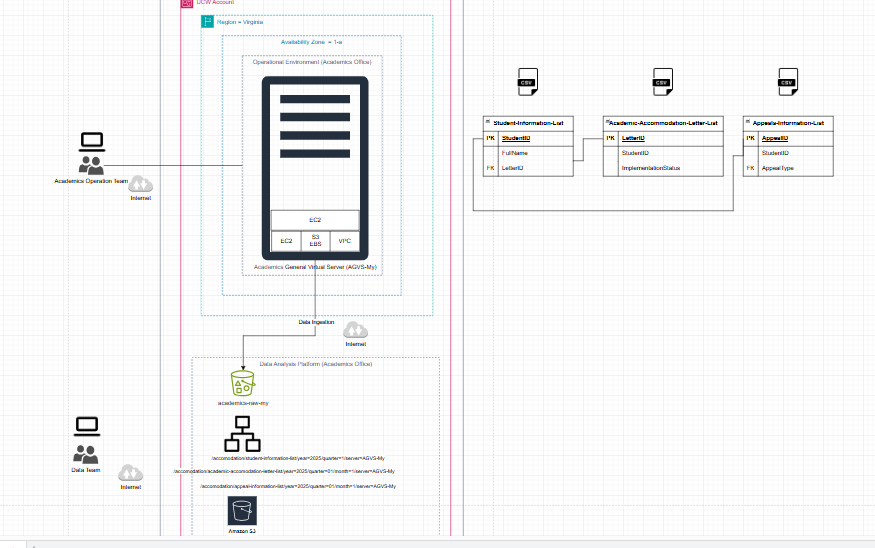
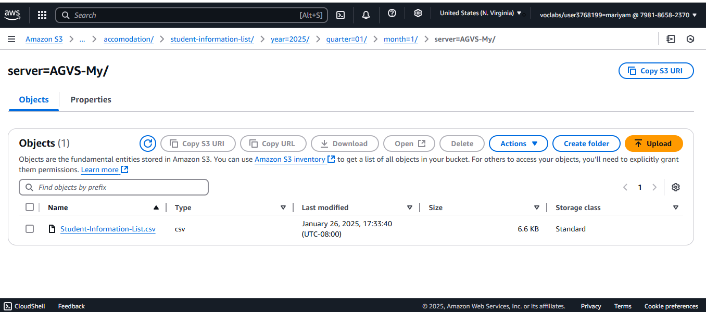
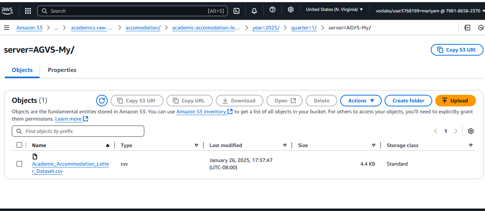
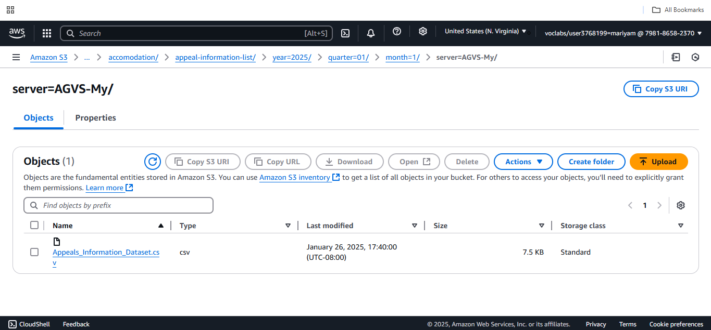

# Automated Data Ingestion
# Automated Data Ingestion for Academic Accommodation for Students with Accessibility Needs(5051p) at University Canada West

---

### **Project Title**
**Automated Data Ingestion for Academic Accommodation Requests at UCW using AWS S3**

---

### **Project Description**
This project is part of a university-wide initiative to modernize UCW’s data infrastructure supporting **academic accommodations** for students with accessibility needs. Aligned with **UCW Procedure 5051p**, this initiative introduces a fully automated and auditable system for ingesting academic accommodation records into AWS S3 using PowerShell and structured folder hierarchy.

The system is built to ensure secure, version-controlled delivery of critical datasets like **Student Information**, **Academic Accommodation Letters**, and **Appeals Information** from the operational EC2 server to a central S3-based data lake. These datasets serve multiple stakeholders including Academic Operations, Accessibility Services, and the Registrar’s Office. This process forms the first step in a broader academic data pipeline supporting compliance, analytics, and service improvement.

---

### **Objective**
The core objective is to establish a secure, consistent, and metadata-tagged ingestion mechanism to automate the transfer of CSV datasets to the AWS S3 data lake. The pipeline supports traceability, temporal classification (by year/quarter/month), and reliable correlation across academic records via shared identifiers (e.g., `StudentID`).

---

### **Datasets**

#### 📄 Student-Information-List.csv
- **Description**: Core student registry file
- **Fields**: 
  - **Student ID** – Unique identifier for each student.  
  - **Full Name** – Full legal name of the student.  
  - **Email** – Email address of the student.  
  - **Phone Number** – Contact number for the student.  
  - **Date of Birth** – Date of birth in YYYY-MM-DD format.  
  - **Enrollment Date** – The date the student enrolled in their program.  
  - **Program** – The academic program or major the student is enrolled in.  
  - **Disability Status** – Indicates whether the student has a registered disability.  
  - **Accommodation Plan** – Summary or ID of the approved academic accommodation plan.  
  - **Advisor Name** – Name of the academic advisor assigned to the student.

#### Academic_Accommodation_Letter_Dataset.csv
- **Description**: Details of approved academic accommodations
- **Fields**:
  - **Letter ID** – Unique identifier for each accommodation letter.  
  - **Student ID** – Reference ID linking to the student receiving accommodations.  
  - **Issue Date** – Date when the accommodation letter was issued.  
  - **Expiry Date** – Date when the accommodations expire or require reevaluation.  
  - **Approved Accommodations** – List of accommodations approved for the student (e.g., extra time, note-taking assistance).  
  - **Faculty/Department** – Academic unit responsible for implementing the accommodations.  
  - **Implementation Status** – Status indicating whether the accommodations have been successfully implemented.  
  - **Concerns Raised by Faculty** – Notes any concerns or objections raised by faculty regarding the accommodations.  
  - **Registrar Copy Shared** – Indicates if a copy of the letter was shared with the Registrar's Office.  
  - **Documentation Compliance** – Status showing whether the required documentation (e.g., medical forms) was submitted and verified.  

#### Appeals_Information_Dataset.csv
- **Description**: Student-initiated appeals related to accommodation
- **Fields**:
  - **Appeal ID** – Unique identifier for each appeal record.  
  - **Student ID** – Unique identifier referencing the student involved in the appeal.  
  - **Appeal Submission Date** – Date the appeal was submitted.  
  - **Appeal Type** – Type or category of the appeal (e.g., academic, conduct-related).  
  - **Description of Appeal** – Summary of the appeal's context or issue.  
  - **Informal Resolution Attempted** – Indicates whether informal resolution steps were tried prior to formal appeal.  
  - **Appeal Resolution Status** – Current status of the appeal (e.g., pending, resolved).  
  - **Appeal Decision Date** – Date the final decision on the appeal was made.  
  - **Decision-Making Authority** – Role or department responsible for deciding the appeal.  
  - **Follow-up Action Required** – Notes if any further action is required post-resolution.

---

### **Design**

- This image is generated from draw.io

---

### **1. Data Storgae in S3**

Each dataset is ingested using precise versioned folder keys that track origin, year, quarter, and upload server. This structure supports auditing, retention management, and future pipeline extensibility.
- Created Folders inside S3 raw bucket.
- Ingestion of each dataset is defined based on their access patterns.
  /accomodation/student-information-list/year=2025/quarter=1/server-AGVS-My
  /accomodation/academic-accomodation-letter-list/year=2025/quarter=1/month=1/server-AGVS-My
  /accomodation/appeal-information-list/year=2025/quarter=1/month=1/server-AGVS-My

---

### **2. Ingestion Process**
- Created EC2 Instance named AGVS-My
- Chose Windows AMI and t3.micro instance type (2 CPU, 1 GiB Memory)
- Used Vockey Key Pair for encryption
- Configured RDP access for remote connection
- Generated username, password and public DNS to connect to the sample virtual server created for UCW Academics Opeartion team
- Used 'Windows App' to connect to the remote virtual server using the pre generated credentials
- The ingestion process is implemented through PowerShell scripts run on an EC2 instance, utilizing the `Write-S3Object` command to upload CSV files directly to S3 with custom key naming.

---
### **Results and Insights**
- Successfully created a remote virtual server to simulate UCW Academics operations and designed an organized S3 data lake for long-term data storage.
- Implemented automated data ingestion using Windows PowerShell on AWS EC2, verifying quarterly ingestion rates for instructor, student, and department data.

- Successful ingestion of Student-Information-List in S3

  

- Successful ingestion of Academic_Accommodation_Letter_Dataset in S3

  

- Successful ingestion of Appeals_Information_Dataset in S3

---

### **Compliance with UCW Procedure 5051p**
This system helps meet regulatory and internal policy requirements:
- Supports transparency of accommodation workflows
- Ensures appeals and accommodations are traceable
- Enables historical reconstruction and audit readiness

UCW’s Accessibility Office, Registrar, and Academic Services benefit from:
- Centralized data access
- Snapshot-style historical versions
- Streamlined service improvement workflows

---

This automated data ingestion system for UCW’s academic accommodation datasets is a scalable, cloud-native solution. By leveraging EC2 for operational connectivity and S3 for lifecycle-enabled storage, it creates a foundation for secure academic governance, accessibility monitoring, and data analytics.

