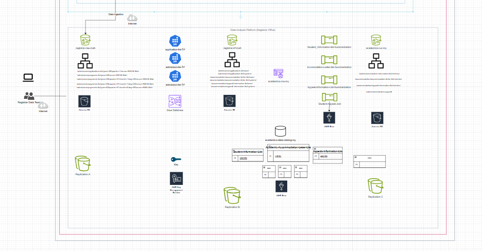
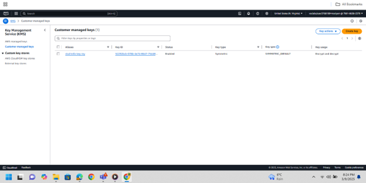
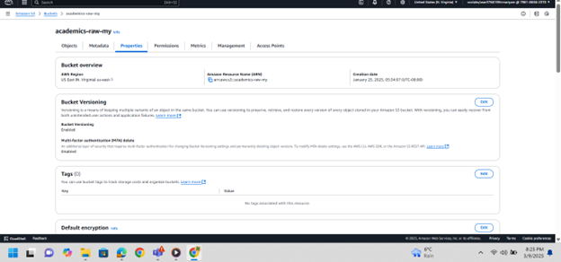
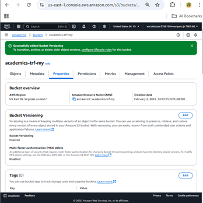
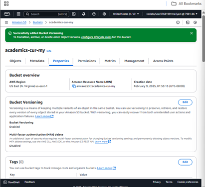
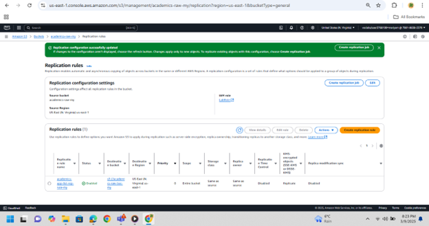
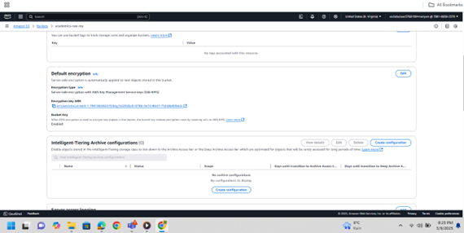
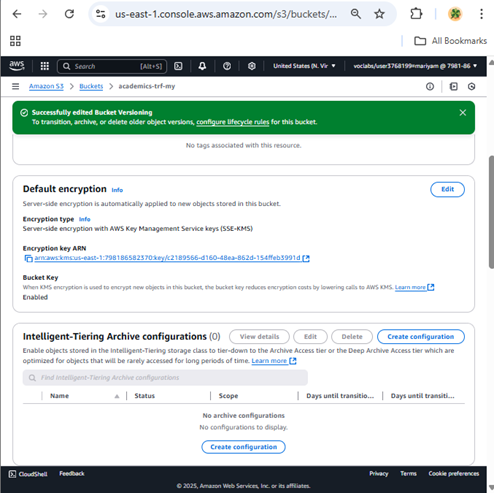
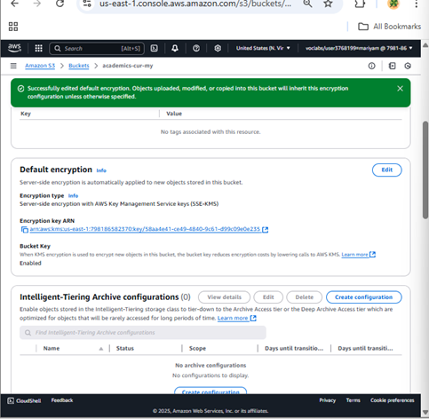

# Data Lake Security Implementation

## Project Title:  
**Data Lake Security Implementation for Academic Accommodation for Students with Accessibility Needs(5051p) at UCW**

---

## Objective:  
To protect the data lake from CIA threats and implement a secure academic data lake that stores, organizes, and governs sensitive student-related datasets—such as accommodation letters in the UCW's policy of Academic Accommodation for Students with Accessibility Needs using AWS S3 with built-in encryption, versioning, and replication to ensure privacy, integrity, and availability.

---

## Background:  
University Canada West manages sensitive academic information including accessibility accommodations and appeal records. To support compliance and data lifecycle management, a multi-layered data lake architecture was implemented using AWS S3 buckets, with security features such as **KMS encryption**, **version control**, and **cross-bucket replication** for disaster recovery and traceability.

---

#### 📄 Student-Information-List.csv
- **Description**: Core student registry file
- **Fields**: 
  - **Student ID** – Unique identifier for each student.  
  - **Full Name** – Full legal name of the student.  
  - **Email** – Email address of the student.  
  - **Phone Number** – Contact number for the student.  
  - **Date of Birth** – Date of birth in YYYY-MM-DD format.  
  - **Enrollment Date** – The date the student enrolled in their program.  
  - **Program** – The academic program or major the student is enrolled in.  
  - **Disability Status** – Indicates whether the student has a registered disability.  
  - **Accommodation Plan** – Summary or ID of the approved academic accommodation plan.  
  - **Advisor Name** – Name of the academic advisor assigned to the student.

#### Academic_Accommodation_Letter_Dataset.csv
- **Description**: Details of approved academic accommodations
- **Fields**:
  - **Letter ID** – Unique identifier for each accommodation letter.  
  - **Student ID** – Reference ID linking to the student receiving accommodations.  
  - **Issue Date** – Date when the accommodation letter was issued.  
  - **Expiry Date** – Date when the accommodations expire or require reevaluation.  
  - **Approved Accommodations** – List of accommodations approved for the student (e.g., extra time, note-taking assistance).  
  - **Faculty/Department** – Academic unit responsible for implementing the accommodations.  
  - **Implementation Status** – Status indicating whether the accommodations have been successfully implemented.  
  - **Concerns Raised by Faculty** – Notes any concerns or objections raised by faculty regarding the accommodations.  
  - **Registrar Copy Shared** – Indicates if a copy of the letter was shared with the Registrar's Office.  
  - **Documentation Compliance** – Status showing whether the required documentation (e.g., medical forms) was submitted and verified.  

#### Appeals_Information_Dataset.csv
- **Description**: Student-initiated appeals related to accommodation
- **Fields**:
  - **Appeal ID** – Unique identifier for each appeal record.  
  - **Student ID** – Unique identifier referencing the student involved in the appeal.  
  - **Appeal Submission Date** – Date the appeal was submitted.  
  - **Appeal Type** – Type or category of the appeal (e.g., academic, conduct-related).  
  - **Description of Appeal** – Summary of the appeal's context or issue.  
  - **Informal Resolution Attempted** – Indicates whether informal resolution steps were tried prior to formal appeal.  
  - **Appeal Resolution Status** – Current status of the appeal (e.g., pending, resolved).  
  - **Appeal Decision Date** – Date the final decision on the appeal was made.  
  - **Decision-Making Authority** – Role or department responsible for deciding the appeal.  
  - **Follow-up Action Required** – Notes if any further action is required post-resolution.

---

## Design:

 
 
 This design is from draw.io
---

## Methodology:

### Data Lake Architecture

Three S3 buckets were provisioned to represent raw, transformed, and curated layers of the academic data lake:

- **Bucket 1: `academics-raw-my`**  
  - Stores unprocessed, original data files.
  - **Security Features**:  
    - AWS **KMS encryption** enabled for data-at-rest  
    - **Versioning** enabled to maintain change history  
    - **Replication rules** configured for redundancy  

- **Bucket 2: `academics-trf-my`**  
  - Stores datasets after transformation (e.g., cleaned schema).
  - **Security Features**:  
    - AWS **KMS encryption** enabled for data-at-rest  
    - **Versioning** enabled to maintain change history  
    - **Replication rules** configured for redundancy

  - **Bucket 3: academics-cur-my**
  - Stores curated, final datasets ready for querying or analysis.
  - **Security Features**:
    - AWS **KMS encryption** enabled for data-at-rest  
    - **Versioning** enabled to maintain change history  
    - **Replication rules** configured for redundancy

### Data Management Steps:
1. Ingest raw CSV files into academics-raw-my  
2. Transform data using AWS Glue DataBrew   
3. Output transformed files to academics-trf-my  
4. Store final curated versions in academics-cur-my for access by downstream services
   
### Data Lake Security Implementation

1. **Encryption**  
   - All three buckets use AWS **Key Management Service (KMS)** to encrypt files at rest.
   - Created a **symmetric key** using **AWS Key Management Service (KMS)**.
   - Assigned administrative and usage permissions to IAM role `LabRole`.

           

2. **Versioning**  
   - Enabled to maintain previous versions of all files, protecting against accidental deletion or overwrites.
     
     
     
     
     
     
     

3. **Replication**  
   - Configured S3 replication rules to duplicate data across buckets or regions for durability and disaster recovery.

     
     
     
     
     

4. **Access Management**  
   - IAM roles and policies (e.g., LabRole) assigned to control who can read/write to each bucket.

5. **Data Lifecycle**  
   - Data transitions from `raw` to `transformed` to `curated` layers, ensuring separation of duties and controlled access at each stage.
   
     
     
     
     
     

---

## Tools and Technologies:

- **AWS S3** – Central data lake storage with layered architecture  
- **AWS KMS** – For encryption and secure key management  
- **S3 Versioning** – To track file changes and support data recovery  
- **S3 Replication** – For cross-bucket or cross-region redundancy  
- **IAM (LabRole)** – For granular access control  
- **CSV Format** – Standard format for compatibility and readability  
- **AWS Glue DataBrew** – For data profiling and transformation tasks  

---

## Deliverables:

- A three-tiered academic data lake (`raw`, `transformed`, and `curated`)  
- KMS-encrypted, version-controlled, and replicated datasets  
- Verified access permissions via IAM role policies  
- System documentation detailing data flow and security implementation  
- Compliance-ready academic data architecture aligned with governance best practices

---

## Timeline:

- **Week 1** – Dataset collection and raw bucket setup with encryption  
- **Week 2** – Versioning and replication configurations  
- **Week 3** – Data transformation and role-based access control  
- **Week 4** – Curation, documentation, and validation of security policies
