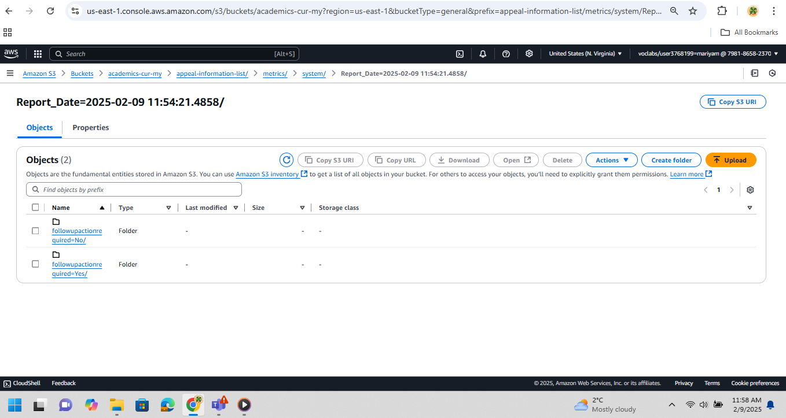

# Project 2: AWS Data Lake Architecture with Glue-based ETL and Cataloging
## Project Title:  
**AWS Data Lake Architecture for Academic Records using Glue-based ETL and Elastic Beanstalk Logging in Academic Accommodation for Students with Accessibility Needs (5051p) at UCW**

---

## Objective:  
To develop an automated data lake architecture for managing academic datasets, with partitioned ETL pipelines and log ingestion using AWS Glue, S3, and Elastic Beanstalk, supporting scalable storage, transformation, and future visualization.

---

## Background:  
Managing academic data such as student information, accommodation letters, and appeal records requires scalable ETL processing, reliable storage, and secure access for the Academic Accommodation for Students with Accessibility Needs procedure in University Canada West. Traditional systems often lack partitioning, visibility, and traceability. This project addresses those gaps using AWS-native services to automate ingestion, cleaning, cataloging, and secure delivery of data for compliance and decision-making.

---

## Dataset:  
1. **Student_Information_Dataset** – Includes student profiles, enrollment, program details, disability status, and advisor assignments.
2. **Academic_Accommodation_Letter_Dataset** – Contains approved accommodations, letter issuance/expiry, implementation status, and compliance.
3. **Appeals_Information_Dataset** – Tracks appeal types, decisions, resolutions, and follow-up requirements.

Partitioning Strategy:  
- Student dataset: Partitioned by list of `Program`  
- Accommodation letters: Partitioned by status for `Approved Accommodations`  
- Appeals: Partitioned by status for `Follow-up Action Required`

---

## Design: 

 

  - This image is generated from draw.io

---

## Methodology:  
- Create ETL pipelines using AWS Glue (Visual Jobs) for each dataset.
- Transform schemas, filter records, summarize insights, and convert to Parquet  
- Use AWS Glue Data Catalog for schema registration.
- Output partitioned data to Amazon S3.
- Ingest web logs using AWS Elastic Beanstalk with log export to S3.
- Monitor job health and outputs using Glue metrics and S3 folder structures.

## Tools and Technologies:  
- **ETL & Summarization:** AWS Glue (Visual, PySpark)  
- **Storage:** Amazon S3 (`academics-trf-my`, `academics-cur-my`)  
- **Data Cataloging:** AWS Glue Crawlers & Data Catalog  
- **Web Application Logs:** AWS Elastic Beanstalk (Python)  
- **Monitoring:** S3 object structure, Glue job metrics  
- **Planned Visuals:** Amazon QuickSight for further analysis

## Deliverables:  
- Fully functional AWS Glue ETL pipelines for three datasets
  

  - This ETL is for Student_Information_Dataset
    

    

   This ETL is for Academic_Accommodation_Letter_Dataset
    

    

    This ETL is for Appeals_Information_Dataset
    
 - Partitioned Parquet outputs in S3
   

    

    - This output shows Student_Information_Dataset partitioned for Programs
          
  
    

    - This output shows Appeals_Information_Dataset partitioned for Followupaction required status      

    

    - This output shows Academic_Accommodation_Letter_Datase partitioned for approved accomodation status      
    
- Glue Data Catalog tables for queryable access  
- Beanstalk-deployed Python web app for user logging

  

  - This image is generated from draw.io
    
- Log storage in S3 for user behavior analysis

  

  - This image is generated from draw.io    
    
- Documented data flow, security settings, and folder structure  

## Timeline:  
| Phase                            | Timeline             |
|----------------------------------|-----------------------|
| Requirement Analysis             | Week 1                |
| Dataset Collection & Preparation| Week 2                |
| Glue ETL Development            | Week 3 – 4            |
| Beanstalk Web App & Logging     | Week 4                |
| Partitioning & Parquet Output   | Week 5                |
| Data Catalog & Schema Crawler   | Week 5                |
| S3 Organization & Validation    | Week 6                |
| Documentation & Final Report    | Week 7                |

